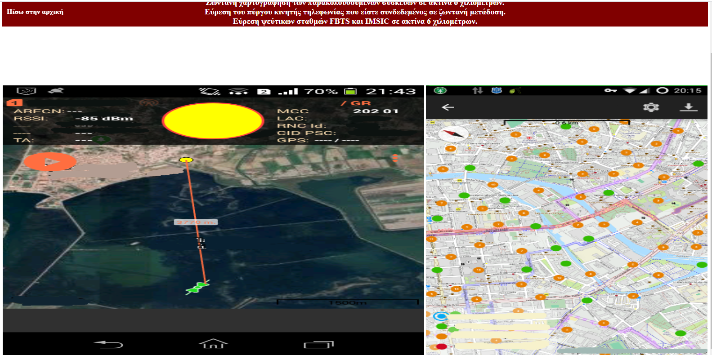

# antispymt
Integrated anti-spy system for mobile phones - android tablet.

http://antispymt.c1.biz/

i) Ready monitoring antii-spy devices.   
ii) Convert your phone - tablet to a anti-spy  device.  
Protection of telephone conversations. (Conduct secure chats from secure networks and secure areas)  
Silent sms protection. A silent sms is sent by the police authorities without you noticing it to extract your current location from your phone.  
Sms services. (Mail sms, Encrypted sms, silent sms (non-detectable), fake sms, fake caller, phone status (open closed)).  
Live monitoring of cell towers (GSM) per telephone company.  
All functions work remotely via GSM (Global Mobile Communication System).   

    
    
    
    

